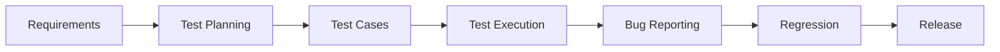

━━━━━━━━━━━━━━━━━━━━━━━━━━━━━━━━━━━━━━━

📅 Professional Experience:  2+ Years

🧪 Test Cases Executed:      1400+

🐞 Bugs Found & Reportde:    350+

🚀 Release Validations:      60+

━━━━━━━━━━━━━━━━━━━━━━━━━━━━━━━━━━━━━━

Passionate Software QA Engineer dedicated to delivering reliable, high-quality software through meticulous testing and automation.

Specialized in Manual Testing, API Testing, Regression Testing, and Test Automation using Playwright & Python.

I enjoy transforming complex requirements into reliable testing strategies that improve product quality and user experience.

